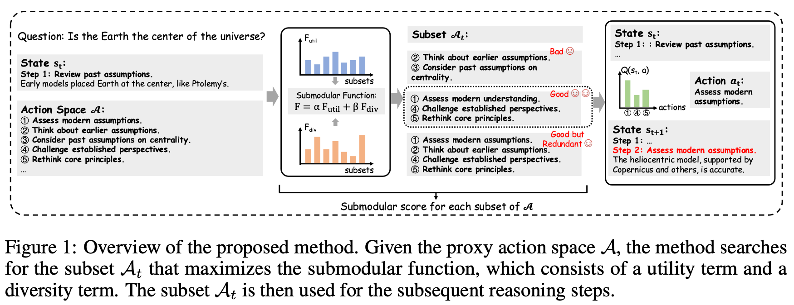

<h2 align="center">
  <b>DynaAct: Large Language Model Reasoning with Dynamic Action Spaces</b>
  <br><span style="font-size:0.9em; color:#6a737d;"><em>NeurIPS 2025</em></span>
</h2>

---

## ✨ Overview

**DynaAct** is a framework for enhancing **sequential reasoning** in Large Language Models (LLMs) by **dynamically constructing compact action spaces**.  
It introduces a **submodular function–based optimization** that jointly maximizes **utility** (relevance to the current reasoning state) and **diversity** (non-redundant reasoning directions).  

This dynamic action selection enables LLMs to **think more efficiently** — focusing on the most informative reasoning steps while maintaining low inference latency.

---

## ⚙️ Key Idea

At each reasoning step:
1. A **proxy action space** is estimated from general reasoning sketches using an LLM.
2. A **submodular function** evaluates candidate actions by utility and diversity.
3. A **greedy algorithm** selects an optimal subset of actions.
4. **Monte Carlo Tree Search (MCTS)** estimates Q-values for selected actions to drive reasoning.

<p align="center">
  
</p>

---

## 🚀 Installation

```bash
git clone https://github.com/zhaoxlpku/DynaAct
cd DynaAct
pip install -r requirements.txt
````

---

## 🧩 Pipeline Overview

The DynaAct reasoning pipeline consists of **three main stages**:

| Stage                            | Description                                            | Script                         |
| :------------------------------- | :----------------------------------------------------- | :----------------------------- |
| 1️⃣ Action Embedding Preparation | Train embedding model for utility/diversity evaluation | `prepare_action_embeddings.py` |
| 2️⃣ Dynamic Reasoning with MCTS  | Perform dynamic action selection and reasoning         | `mcts.py`                      |
| 3️⃣ Evaluation                   | Compute exact-match accuracy across benchmarks         | `calc_acc.py`                  |

---

## 🧠 Usage Examples

### 1. Prepare Action Embeddings

Train the embedding model that captures the Q-learning–based utility signal for action selection.

````bash
python prepare_action_embeddings.py \
  --data_path demo/platypus_sketches.jsonl \
  --output_path output/action_embeddings.pt \
  --submodular_base_path /path/to/Llama-3.2-1B-Instruct \
  --submodular_lora_path /path/to/lora/model
````

---

### 2. Run MCTS with Dynamic Action Spaces

Execute dynamic reasoning with submodular action selection and Monte Carlo Tree Search.

````bash
python mcts.py \
  --data_path data/mcts_gsm8k_test.jsonl \
  --output_path output/mcts_gsm8k_test_submodular_rollouts.jsonl \
  --pickle_path  output/mcts_gsm8k_test_submodular_rollouts.pkl \
  --model_path /path/to/Meta-Llama-3.1-8B-Instruct \
  --embedding_path output/action_embeddings.pt \
  --submodular_base_path /path/to/Llama-3.2-1B-Instruct \
  --submodular_lora_path /path/to/lora/model \
  --n_gpus 1 \
  --temperature 0.2 \
  --max_len 1024 \
  --seed 42 \
  --max_depth 8 \
  --min_depth 2 \
  --n_confidence 16 \
  --n_attempts 8 \
  --aggregate_child mean \
  --aggregate_reward mean \
  --n_iters 16 \
  --submodular_weight 0.8 \
  --submodular_size 5
````

---

### 3. Evaluate Performance

Compute accuracy on target benchmarks (e.g., MMLU, GSM8K, MATH-500).

````bash
python calc_acc.py \
  --output_path output/mcts_gsm8k_test_submodular_rollouts.jsonl
````

---

## 📊 Main Results

| Benchmark             |    MMLU   |  MMLU-Pro |    GPQA   |   ARC-C   |   GSM8K   |  MATH-500 |
| :-------------------- | :-------: | :-------: | :-------: | :-------: | :-------: | :-------: |
| **Zero-Shot CoT**     |   68.87   |   43.45   |   31.82   |   81.06   |   76.12   |   45.40   |
| **SC@maj16**          |   69.66   |   49.36   |   34.34   |   80.63   |   86.66   |   52.00   |
| **RAP**               |   69.46   |   48.70   |   38.89   |   85.41   |   87.79   |   51.60   |
| **rStar**             |   68.61   |   48.81   |   36.87   |   86.43   |   87.11   |   54.20   |
| 🧩 **DynaAct (ours)** | **70.22** | **51.40** | **39.39** | **88.31** | **89.16** | **61.00** |

DynaAct consistently improves reasoning accuracy across **general**, **reasoning**, and **mathematical** domains — with a **+6.8% gain** on MATH-500.


---

## 📜 Citation

If you find **DynaAct** useful, please cite our NeurIPS 2025 paper:

````bibtex
@inproceedings{zhao2025dynaact,
  title     = {DynaAct: Large Language Model Reasoning with Dynamic Action Spaces},
  author    = {Xueliang Zhao and Wei Wu and Jian Guan and Qintong Li and Lingpeng Kong},
  booktitle = {Neural Information Processing Systems (NeurIPS)},
  year      = {2025}
}
````
